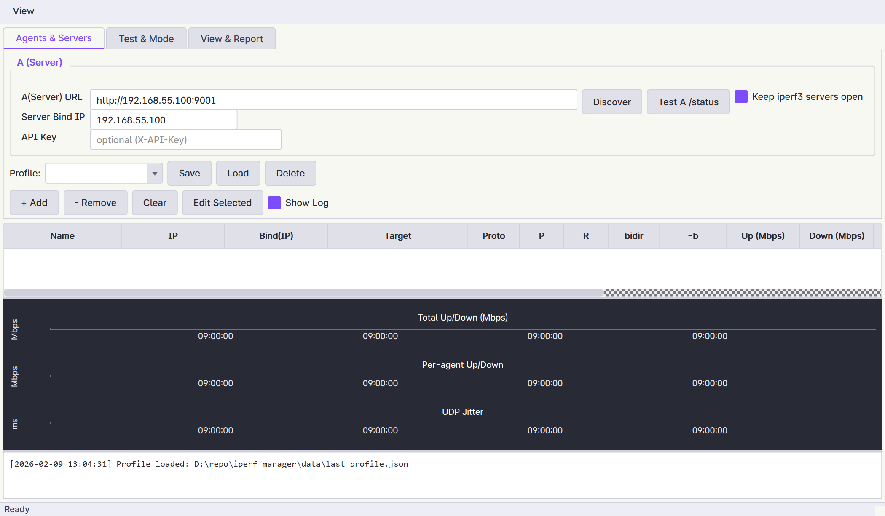
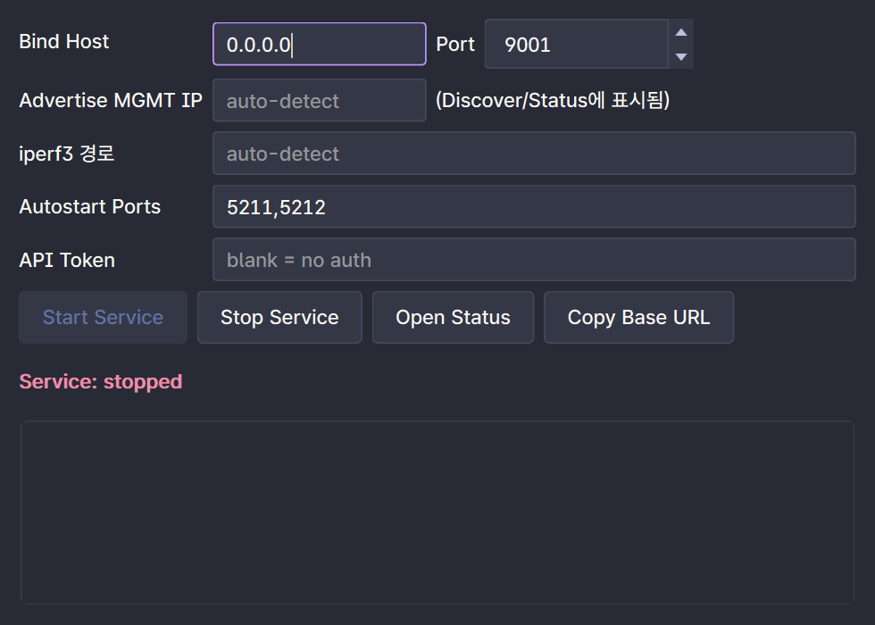

# iperf_manager

A distributed iperf3 network performance testing system with a real-time GUI dashboard. Deploy lightweight agents on test hosts and orchestrate multi-client throughput tests from a central dashboard.


## Features

- **Distributed Architecture** -- Deploy agents on multiple hosts; orchestrate tests from one dashboard
- **Real-Time Monitoring** -- Live throughput charts (total, per-agent, UDP jitter/loss) updated every second
- **Multi-Client Testing** -- Run simultaneous iperf3 sessions across multiple client/server pairs
- **Test Modes** -- Bidirectional, upload-only, download-only, dual, two-phase
- **TCP & UDP** -- Full support for both protocols with per-client configuration
- **Auto-Discovery** -- Find agents on the local network via UDP broadcast
- **Profile Management** -- Save, load, and delete test configurations
- **HTML Reports** -- Generate reports with embedded throughput/jitter/loss charts
- **CSV Export** -- Wide-format metrics export for further analysis
- **Dark / Light Theme** -- Dracula color palette with theme toggle (`Ctrl+T`)
- **Headless Mode** -- Run agents without GUI for server/daemon deployment
- **CLI Controller** -- Config-driven headless test execution for CI/automation

## Architecture

```
Dashboard / Controller (orchestrator)
    |  REST API (HTTP)
    +---> Agent A (server-side)          Agent B (client-side)
              | spawns                       | spawns
          iperf3 -s  <--- traffic --->   iperf3 -c
              |                              |
              +------ /metrics polling ------+
```

| Component | Description | Entry Point |
|-----------|-------------|-------------|
| **Agent** | REST API service managing iperf3 processes on a host | `main_agent.py` |
| **Dashboard** | PySide6 GUI for test orchestration and live visualization | `main_dashboard.py` |
| **Controller** | CLI tool for headless/automated test execution | `controller_v5_18.py` |

## Screenshots

| Dark Theme | Light Theme |
|:---:|:---:|
|  |  |

**Agent Window:**



## Quick Start

### Prerequisites

- Python 3.10+
- [iperf3](https://iperf.fr/iperf-download.php) binary on each agent host

### Install Dependencies

```bash
pip install -r requirements.txt
```

Dependencies: `PySide6`, `pyqtgraph`, `numpy`, `matplotlib`

### 1. Start Agents

Run on each test host (server and client machines):

```bash
python main_agent.py
```

Or headless (no GUI):

```bash
python main_agent.py --headless
```

The agent starts a REST API on port **9001** (configurable) and listens for UDP discovery on port **9999**.

### 2. Start Dashboard

Run on any machine that can reach the agents:

```bash
python main_dashboard.py
```

### 3. Configure and Run Tests

1. **Agents & Servers** tab -- Set server agent URL, bind IP, and click **Discover** to find client agents
2. **Test & Mode** tab -- Choose test mode, duration, protocol, and per-client settings
3. Click **Start** to begin the test
4. **View & Report** tab -- Generate HTML reports and export CSV

## Agent Configuration

| Setting | Default | Description |
|---------|---------|-------------|
| Bind Host | `0.0.0.0` | Interface to listen on |
| Port | `9001` | REST API port |
| Advertise MGMT IP | auto-detect | IP shown in discovery responses |
| iperf3 Path | auto-detect | Path to iperf3 binary (use **Browse** to select) |
| Autostart Ports | `5211,5212` | iperf3 server ports to start automatically |
| API Token | *(empty)* | Optional `X-API-Key` header for authentication |

Agent config is persisted to `%LOCALAPPDATA%\iperf3-agent\config.json`.

## Keyboard Shortcuts

| Shortcut | Scope | Action |
|----------|-------|--------|
| `Ctrl+T` | Dashboard / Agent | Toggle dark/light theme |

## Agent REST API

| Endpoint | Method | Description |
|----------|--------|-------------|
| `/server/start` | POST | Start iperf3 servers (`ports`, `bind`, `bind_map`) |
| `/server/stop` | POST | Stop iperf3 servers |
| `/client/start` | POST | Start iperf3 clients (`target`, `port`, `duration`, `proto`, `parallel`, `bitrate`, `bidir`, `reverse`) |
| `/client/stop` | POST | Stop iperf3 clients |
| `/metrics` | GET | Poll real-time throughput metrics |
| `/status` | GET | Agent status, log directory, advertise IP |

## Test Configuration

Test profiles are saved as JSON. Example:

```json
{
  "server": {
    "agent": "http://192.168.1.10:9001",
    "bind": "192.168.1.10"
  },
  "clients": [
    {
      "name": "client-1",
      "agent": "http://192.168.1.20:9001",
      "target": "192.168.1.10",
      "proto": "tcp",
      "parallel": 4,
      "bitrate": "0",
      "bidir": true,
      "reverse": false
    }
  ],
  "mode": "bidir",
  "duration_sec": 60,
  "base_port": 5211,
  "keep_servers_open": true
}
```

### Test Modes

| Mode | Description |
|------|-------------|
| `bidir` | Bidirectional (iperf3 `--bidir`) |
| `up_only` | Client-to-server only |
| `down_only` | Server-to-client only (iperf3 `--reverse`) |
| `dual` | Both directions simultaneously |
| `two_phase` | Upload phase then download phase sequentially |

### Constraints

- UDP tests cannot use `--bidir` or parallel > 1 (iperf3 limitation)

## CLI Controller

For headless/automated testing:

```bash
python controller_v5_18.py --config test_config.json --out results.csv
```

| Option | Default | Description |
|--------|---------|-------------|
| `--config` | *(required)* | Path to test configuration JSON |
| `--out` | `controller_result.csv` | CSV output path |

## Build

Build standalone Windows executables with PyInstaller:

```bash
# Build both agent and dashboard (onedir + onefile + zip)
python build.py

# Build agent only
python build.py agent

# Build dashboard only
python build.py dashboard

# Build onefile only (single .exe)
python build.py --onefile

# Build onedir only (directory with DLLs)
python build.py --onedir

# Skip zip compression
python build.py --no-zip
```

Output goes to `release/`:
```
release/
  iperf3-agent_v6.0.2/        # onedir bundle
  iperf3-agent_v6.0.2.zip     # zipped onedir
  iperf3-agent_v6.0.2.exe     # single exe
  iperf3-dashboard_v7.0.0/
  iperf3-dashboard_v7.0.0.zip
  iperf3-dashboard_v7.0.0.exe
```

Build requires: `pip install pyinstaller`

> **Note:** The agent bundle includes `iperf3.exe` and Cygwin DLLs. The dashboard does not include iperf3 (it only sends REST API commands to agents).

### iperf3 Binary Setup

The `iperf3.exe` and Cygwin DLLs are **not included** in the repository. Place them in the project root before building the agent:

```
iperf3.exe
cygwin1.dll
cygz.dll
cygcrypto-3.dll
```

Download from: [iperf.fr](https://iperf.fr/iperf-download.php) (Windows build includes Cygwin DLLs).

## Project Structure

```
iperf_manager/
  main_agent.py            # Agent entry point
  main_dashboard.py        # Dashboard entry point
  controller_v5_18.py      # CLI controller
  build.py                 # Build script
  requirements.txt
  agent.spec               # PyInstaller spec (agent)
  dashboard.spec            # PyInstaller spec (dashboard)
  core/
    agent_service.py       # REST API + iperf3 process management
    test_runner.py         # Test orchestration (server/client lifecycle)
    net_utils.py           # HTTP helpers, connection pool, metrics parsing
    config_model.py        # Configuration validation
    csv_recorder.py        # CSV metrics recording with rollover
    report.py              # HTML report generation with matplotlib charts
    constants.py           # Versions, defaults, column definitions
    helpers.py             # iperf3 path resolution, utilities
  ui/
    dashboard_window.py    # Main dashboard window
    agent_window.py        # Agent GUI window
    pages/                 # Tab pages (agents, test, view)
    widgets/               # Live chart, log viewer, table, status indicator
    models/                # Table data model
    delegates/             # Cell editors (checkbox, combo, IPv4, spinbox)
    dialogs/               # Discovery dialog, edit client dialog
    workers/               # Background threads (poller, test runner, discovery)
    theme/                 # Dracula dark/light QSS, colors, arrow SVGs
  data/
    last_profile.json      # Auto-saved last test configuration
    profiles/              # Named profiles
```

## License

[MIT](LICENSE)
